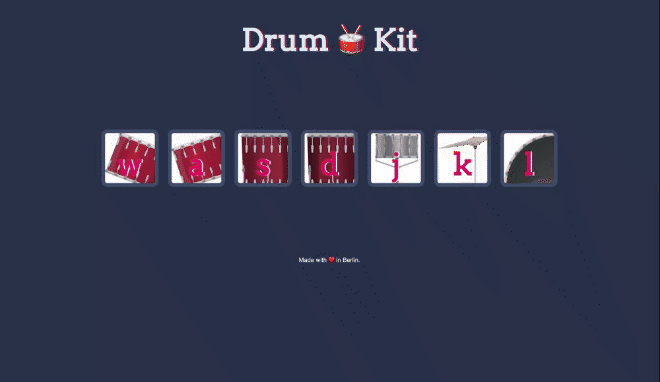

# 🥁 Drum-Kit

##  🥁 Overview

This is a single-page application website made with Vanilla JavaScript that allows users to play a digital Drum-Kit.

## 🥁 Features

-   Users may play different drums, either by clicking on the buttons with the mouse or by pressing the correspondent drum key.
   

## 🥁 Technology

-   
  &nbsp;  &nbsp;  &nbsp; 

-   JavaScript, HTML, CSS

## Preview

**_Drums_**

